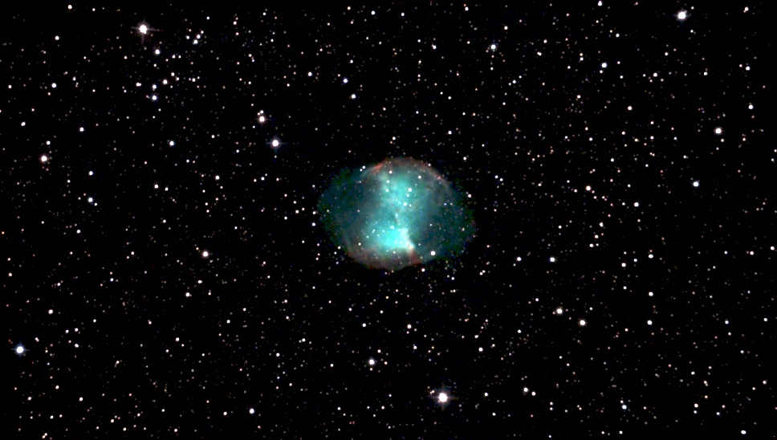
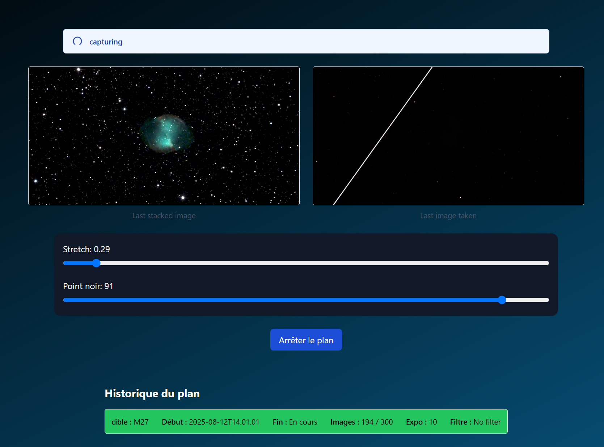

# EasyAstro

EasyAstro is a full-featured web application for automating deep-sky astrophotography.  
It combines a **React** frontend and a **Python FastAPI** backend to orchestrate the entire process: from site and equipment management to automated capture and live stacking.

Initially, I developped a fits stacker in python, but it was too slow if used with short exposures, so I switched to siril. But there is a lot of bugs with siril, and the python client (pysiril) is not stable. And, with siril, it was quite hard to find if the stacking was ok or not, has the client always return False. So I made a new stacker, using multi process for improving the speed. It always try to stack the last available image, it is slow but ok for live stacking. 

This projects works, but there is still a lot of things to do before releasing the v1... It works very well with the simulator, but I now have to try it in the real world :)


Work in progress


---

## ✨ Features

- **Site Management**
  - Create observation sites with custom constraints (e.g., azimuth sectors blocked by trees or mountains).
  - Define site-specific configurations.

- **Equipment Management**
  - Manage telescopes, optics, cameras, and filter wheels.
  - Select the active setup for each observation session.

- **Visibility Calculation**
  - Browse a catalog of deep-sky objects.
  - Compute visibility for any date and time, taking site constraints into account.

- **Observation Planning**
  - Select target objects.
  - Schedule observation runs with:
    - Number of exposures
    - Exposure duration
    - Filter sequences

- **Automated Execution**
  - Autofocus (if supported by the hardware).
  - Plate solving for mount synchronization.
  - Slewing to targets and automated imaging.
  - Real-time livestacking with Winsorized Sigma Clipping.

---

## 📸 Screenshots

Below are some example screenshots showcasing the main features of **AstroAutomate**.

<p align="center">
  
  <br>
  <em>🔹 Home dashboard displaying system status and recent observations.</em>
</p>

<p align="center">
  
  <br>
  <em>🔹 Equipment configuration page where you define your telescope, camera, and filter wheel.</em>
</p>

<p align="center">
  
  <br>
  <em>🔹 Site management view showing observation site constraints (blocked azimuth sectors).</em>
</p>

<p align="center">
  
  <br>
  <em>🔹 Catalog of deep-sky objects, with visibility information.</em>
</p>

<p align="center">
  
  <br>
  <em>🔹 Filtering and selecting targets from the catalog.</em>
</p>

<p align="center">
  
  <br>
  <em>🔹 Observation planner to schedule your imaging sessions (number of exposures, filters, durations).</em>
</p>
<p align="center">
  
  <br>
  <em>🔹 See results in real time with live stacking</em>
</p>
<p align="center">
  
  <br>
  <em>🔹 See results in real time with live stacking</em>
</p>
<p align="center">
  
  <br>
  <em>🔹 Manage sigma clipping for removing artefact</em>
</p>


## 🚀 Technology Stack

- **Frontend:** React
- **Backend:** Python FastAPI
- **Communication:**
  - WebSocket for live updates and streaming.
  - REST API for configuration and scheduling.

---


## 🛠️ Installation

> **Note:** The installation might be a bit tricky if you are not familiar with React and Python. Once this application reaches a good level of reliability, I will create an EXE file to install it.

1. **Clone the repository**
    ```bash
    git clone https://github.com/air01a/easyastroweb
    ```

2. **Compile react frontend for production**
    ```bash
    npm run build
    ```

3. **Copy the frontend**
   Get all files in front/dist to back/frontend/

4. **Install lib dependancies for the back**
    ```bash
    cd back
    python -m venv . 
    scripts/activate
    pip install -r requirements
    ```

5. **Run the backend**
    ```bash
    python main.py
    ```

6. **Connect to frontend**
  Simply go to http://localhost:8000


