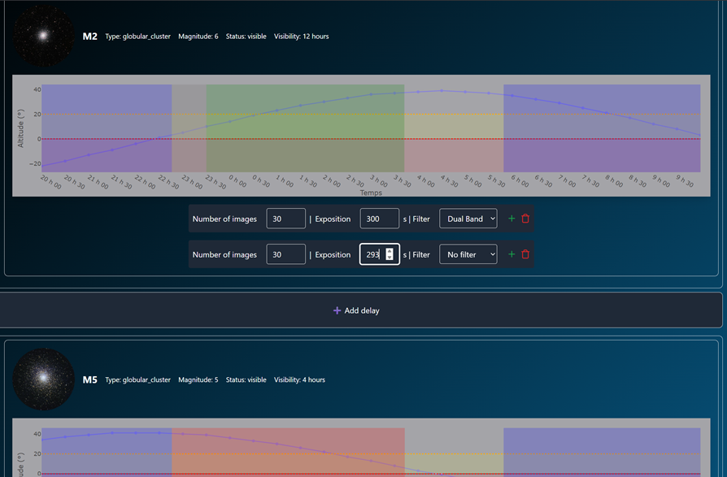

# EasyAstro

EasyAstro is a full-featured web application for automating deep-sky astrophotography.  
It combines a **React** frontend and a **Python FastAPI** backend to orchestrate the entire process: from site and equipment management to automated capture and live stacking.


Work in progress


---

## ✨ Features

- **Site Management**
  - Create observation sites with custom constraints (e.g., azimuth sectors blocked by trees or mountains).
  - Define site-specific configurations.

- **Equipment Management**
  - Manage telescopes, optics, cameras, and filter wheels.
  - Select the active setup for each observation session.

- **Visibility Calculation**
  - Browse a catalog of deep-sky objects.
  - Compute visibility for any date and time, taking site constraints into account.

- **Observation Planning**
  - Select target objects.
  - Schedule observation runs with:
    - Number of exposures
    - Exposure duration
    - Filter sequences

- **Automated Execution**
  - Autofocus (if supported by the hardware).
  - Plate solving for mount synchronization.
  - Slewing to targets and automated imaging.
  - Real-time livestacking with Winsorized Sigma Clipping.

---

## 📸 Screenshots

Below are some example screenshots showcasing the main features of **AstroAutomate**.

<p align="center">
  
  <br>
  <em>🔹 Home dashboard displaying system status and recent observations.</em>
</p>

<p align="center">
  
  <br>
  <em>🔹 Equipment configuration page where you define your telescope, camera, and filter wheel.</em>
</p>

<p align="center">
  
  <br>
  <em>🔹 Site management view showing observation site constraints (blocked azimuth sectors).</em>
</p>

<p align="center">
  
  <br>
  <em>🔹 Catalog of deep-sky objects, with visibility information.</em>
</p>

<p align="center">
  
  <br>
  <em>🔹 Filtering and selecting targets from the catalog.</em>
</p>

<p align="center">
  
  <br>
  <em>🔹 Observation planner to schedule your imaging sessions (number of exposures, filters, durations).</em>
</p>
<p align="center">
  
  <br>
  <em>🔹 See results in real time with live stacking</em>
</p>

## 🚀 Technology Stack

- **Frontend:** React
- **Backend:** Python FastAPI
- **Communication:**
  - WebSocket for live updates and streaming.
  - REST API for configuration and scheduling.

---


## 🛠️ Installation

> **Note:** This is a high-level guide. Please refer to each component’s documentation for details.

1. **Clone the repository**
   ```bash
   ...
